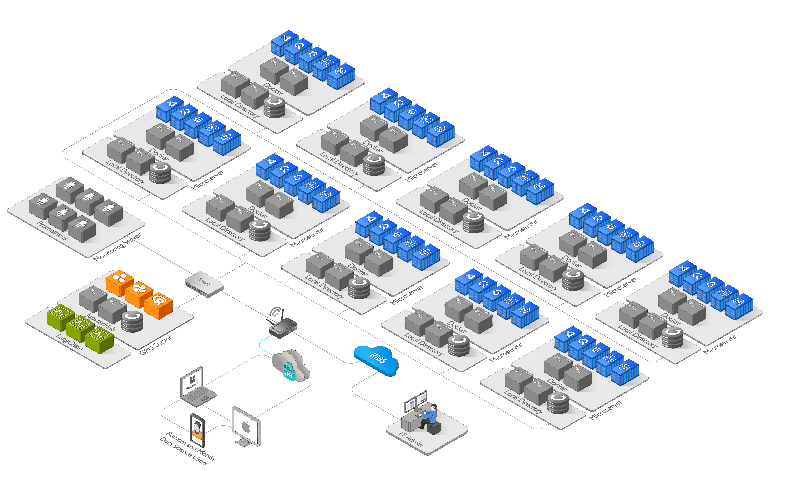

# AI Agent Farm

This repository documents the creation and maintenance of an AI Agent Farm infrastructure that consists of refurbished microservers gen8. The infrastructure runs on Ubuntu 22.04 Server and includes powerful tools, such as JupyterHub, Visual Studio Code, QuestDB, Grafana, and an AI Agent such as ChatGPT, Auto-GPT, ...)

The purpose of this project is to create a scalable infrastructure that can run multiple tasks simultaneously and distribute processes across the AI Agent workers, maximizing efficiency and minimizing downtime. As a demonstration, we have created a specific environment for testing the AI Agent Farm in the field of financial markets.

## Introduction

The idea of running multiple AI tasks from remotely connected microservers to a JupyterHub installed on a GPU server is not common in traditional setups. However, it can be a powerful and efficient approach for distributed computing and leveraging the computational power of the GPU server.

By connecting microservers to a centralized GPU server with JupyterHub, you can create a collaborative and scalable environment for AI tasks. Each microserver can offload computationally intensive tasks to the GPU server, making it possible to handle multiple tasks simultaneously and distribute the workload effectively. The JupyterHub instance provides a user-friendly interface and allows users or AI Agent to access Python and Julia kernels for their AI work.

This setup offers several advantages, including centralized GPU resources, resource sharing, simplified management, scalability, and the ability to run complex AI tasks across multiple microservers. It also promotes collaboration and knowledge sharing among users or AI Agent connected to the GPU server.

While not commonly seen in all AI setups, this approach can be a highly efficient and effective solution for organizations or projects that require distributed computing, collaboration, and access to powerful GPU resources.

## Infrastructure

Setting up an AI Agent Farm with dedicated microservers can offer several advantages over running all processes on a single GPU server. Here are a few reasons why the AI Agent Farm approach can be beneficial:

1. Scalability: With dedicated microservers, you have the flexibility to scale your infrastructure by adding more microservers as needed. This allows you to distribute the workload across multiple machines and handle increased demands without overburdening a single GPU server.

2. Resource Allocation: Each microserver can have its dedicated GPU, ensuring that the machine learning notebooks have exclusive access to the GPU resources. This avoids contention and provides consistent performance for individual notebooks.

3. Isolation: Running processes on separate microservers provides isolation between the notebooks. If there is an issue or crash in one notebook, it won't affect the others, improving the stability and reliability of the overall system.

3. Ease of Management: Managing multiple microservers allows for better organization and control. Each microserver can be independently monitored, maintained, and updated without impacting the operation of other microservers.

4. Fault Tolerance: In case of hardware failure or maintenance needs, having multiple microservers ensures that other notebooks can continue running unaffected. It provides a level of fault tolerance and reduces the risk of complete system downtime.

By distributing the workload across multiple microservers, you can achieve better performance, scalability, and fault tolerance compared to running all processes on a single GPU server. However, it's important to consider the specific requirements and constraints of your project before deciding on the best approach.

### Application Architecture Diagram

 

:pencil: High resolution diagram [Application architecture diagram](https://raw.githubusercontent.com/BouarfaMahi/AI-Agent-Farm/master/application-architecture-diagram.png)

### Features
- The AI Agents can run multiple tasks simultaneously, and processes are distributed across the workers for maximum efficiency.

- The AI Agent Farm is designed to be scalable to accomodate future growth

- Visual Studio Code is remotely connected to a JupyterHub instance installed on a GPU server, providing access to Python and Julia kernels. Each AI Agent has its own JupyterHub user account when using VS Code.

- The real-time streaming data source from Coinbase is connected to each microserver. QuestDB and Grafana are used to store and display the data in real-time. The QuestDB database is ingested by running a notebook in Visual Studio Code (VS Code).

- To ensure data integrity, both the QuestDB database backup and the workspace backup for each AI agent are stored on the GPU server.

- The AI Agent Farm infrastructure is monitored using Prometheus, an open-source monitoring system that provides valuable insights into the performance and health of the system.

### Scalability
The AI Agent Farm has been designed with scalability in mind, ensuring that it can accommodate future growth without any issues. Whether the demand for AI agents increases tenfold or hundredfold, the system is well-equipped to meet it, thanks to JupyterHub. JupyterHub is capable of supporting more than 100 users, making it an ideal tool for managing large-scale AI projects. JupyterHub can be configured to allocate a specific amount of resources (e.g., CPU cores, memory, and GPU) to each environment, depending on the requirements of the tasks that the AI Agent intends to run.

### Dockerization
The four applications used in this project (Visual Studio Code, QuestDB, Grafana, and an AI Agent) can be Dockerized to simplify deployment and management. The Dockerfiles for each application are included in the repository, and instructions for building and running the Docker containers are provided in the documentation. By Dockerizing the applications, it is possible to create a self-contained environment that can be easily moved between systems or replicated on multiple machines. This can simplify deployment and ensure consistency across different environments.

### Backup
To ensure data integrity and prevent data loss, it is important to create regular backups of the QuestDB database and the AI Agent workspace on the remote GPU server.The backup process can be automated using a shell script, which can be scheduled to run regularly using a cron job. 

### Failover & Remote Management System
The AI Agent Farm also includes failover and load balancing functions to ensure high availability and prevent downtime. In addition, a remote management system is provided to enable easy monitoring and control of the infrastructure from anywhere even without a public IP. 

## AI Application Specifications:
The AI application is responsible for managing the AI agents installed on the microservers and distributing tasks to them. The application is installed on a GPU server and is designed to maximize the efficiency of the AI Agent Farm.

The AI application is built using Python and is designed to work with the JupyterHub instance running on the GPU server. The application is modular and allows for easy integration with new AI tools and libraries as needed.

The AI application consists of several modules, including:

1. Data Ingestion Module: This module is responsible for coordinating the ingestion of real-time streaming data from Coinbase across all AI agents and storing it on the RAID storage of each microserver. Each AI agent is responsible for ingesting and storing data in its own QuestDB database. The module includes features such as data validation, error handling, and data transformation to prepare the data for analysis by the AI agents.

2. Task Distribution Module: This module is responsible for distributing tasks to the AI agents installed on the microservers. The module takes into account the processing power and workload of each AI agent and distributes tasks accordingly to maximize efficiency and minimize downtime. The module is designed to handle multiple tasks simultaneously and can be configured to prioritize certain tasks over others based on their importance or urgency.

3. Performance Monitoring Module: This module monitors the performance of each AI agent and the overall performance of the AI Agent Farm. The module collects metrics such as CPU and memory usage, task completion rates, and system uptime, which are then displayed on the Grafana dashboard. The module can be configured to send alerts if performance falls below certain thresholds or if critical errors occur.

## Data Stream Processing & Machine Learning Notebooks

The Data Stream Processing Notebook is responsible for ingesting, processing, and analyzing real-time data streams from various sources, such as financial data streams, sensors or social media feeds. It uses tools like QuestDB and Grafana to store and visualize the data, and can be integrated with other tools like Visual Studio Code.

The Machine Learning Notebook is designed to facilitate machine learning tasks, such as building and training machine learning models, and analyzing data. It typically comes pre-configured with popular machine learning frameworks and libraries, and can support a wide range of data formats and sources.

## Usage

### Quantitative Finance
The AI Agent Farm infrastructure can be used in quantitative finance to analyze large amounts of financial data and make predictions using machine learning models. With the real-time streaming data source from Coinbase or others providers, the QuestDB database, and Grafana, the infrastructure can provide up-to-date and accurate financial data. The AI Agent tool can be used to build and fine-tune machine learning models for financial analysis.

Using the AI Agent Farm infrastructure, quantitative finance professionals can easily run multiple tasks simultaneously and distribute them across the workers, which maximizes efficiency and reduces downtime. The scalability of the infrastructure allows for future growth, ensuring that it can accommodate an increase in demand for AI agents. The JupyterHub instance on the GPU server provides access to Python and Julia kernels, making it an ideal tool for financial analysis.

### Others Fields
The AI Agent Farm infrastructure can also be used in other fields, such as data science, machine learning, and artificial intelligence research. With the ability to run multiple tasks simultaneously and distribute them across the workers. 

Overall, the AI Agent Farm infrastructure is a versatile and scalable tool that can be used in a variety of fields that require high computing power. Its modular design and powerful tools make it an ideal platform for performing complex tasks and experimenting with different techniques and models.

## CPU & GPU Serveur Resources

The AI Agent Farm is equipped with a powerful GPU configuration to support advanced machine learning and artificial intelligence tasks. The system features a choice of 8 GPUs, including the Tesla K80, Tesla P100, or Tesla V100, all of which offer exceptional performance and reliability.

The Tesla K80 GPUs feature dual GPU dies per card, allowing for increased performance and parallel processing capabilities without the need for an additional GPU server.

By allocating one GPU from the Tesla K80 to each microserver, you can effectively run a single machine learning notebook on each microserver without requiring extra GPUs. This streamlined approach simplifies resource allocation and management, enabling independent operation of each microserver with its dedicated GPU.

In addition to the GPU options, the system is also equipped with dual Intel Xeon E5-2680 V3 2.5Ghz 12 Cores 24 Threads per Processor, providing powerful processing capabilities. The system also boasts a generous 256GB of RAM, made up of 16 x 16GB DDR4 REG 2133 modules, ensuring fast and efficient data processing.

To support the storage needs of the AI Agent Farm, the system features 2 x 2TB SSD of RAID Ubuntu 22.04 Server for operating system and software, as well as 2X10TB SATA of RAID data storage for backup, providing ample space for large datasets and ensuring data security. Overall, this GPU configuration is optimized for high-performance computing and is well-suited for AI applications that require large-scale data processing and analysis.

Each microserver is equipped with a 250GB SSD, 16GB of RAM, and 4x1TB of RAID data storage for analysis.

## References

- HP ProLiant MicroServer Gen8 Review. [StorageReview.com](https://www.storagereview.com/review/hp-proliant-microserver-gen8-review)

- [JupyterHub](https://jupyter.org/hub)

- [JupyterHub Installation Guide](https://github.com/jupyterhub/jupyterhub-the-hard-way/blob/HEAD/docs/installation-guide-hard.md)

- Connect to a JupyterHub from Visual Studio Code. [Jupyter Blog](https://blog.jupyter.org/connect-to-a-jupyterhub-from-visual-studio-code-ed7ed3a31bcb)

- [Visual Studio Code](https://code.visualstudio.com/)

- [QuestDB - The Fastest Open Source Time Series Database](https://questdb.io/)

- [Grafana - The open observability platform](https://grafana.com/)

- [ChatGPT](https://platform.openai.com/docs)

- AI Agent Farm Monitoring with JupyterHub and [Prometheus](https://jupyterhub.readthedocs.io/en/stable/reference/monitoring.html)

- Remote Management System [Teltonika Networks RMS](https://wiki.teltonika-networks.com/view/RMS)

## Others

### Contributing

Contributions to the project are welcome. Please feel free to fork the repository and submit pull We welcome contributions from developers and AI enthusiasts who are passionate about building scalable AI infrastructure and exploring cutting-edge technologies. By joining our project, you can benefit in the following ways:

1. Learning Experience: Contribute to the development of a sophisticated AI Agent Farm infrastructure, gaining hands-on experience with distributed computing, containerization using Docker, real-time data processing, and collaboration tools like JupyterHub.

2. Collaboration: Join a vibrant and diverse community of developers, data scientists, and researchers working together to push the boundaries of AI applications. Collaborate, exchange ideas, and contribute to open-source projects that have a real impact.

3. Impactful Projects: Contribute to AI projects with real-world applications, such as quantitative finance, data science, and machine learning. Your contributions can help analyze large financial datasets, build predictive models, and advance research in various fields.

3. Skill Development: Sharpen your coding skills by working on complex AI tasks, optimizing performance, and integrating new AI tools and libraries into the infrastructure. Improve your understanding of distributed systems, data streaming, and machine learning techniques.

We encourage you to explore the project, fork the repository, and submit pull requests. If you have any questions or need assistance, feel free to reach out to us. Together, let's build a powerful and scalable AI infrastructure that drives innovation and transforms various domains.

### Licence
This project is licensed under the MIT License.

### Conclusion
The AI Agent Farm is a powerful infrastructure for running multiple AI tasks simultaneously, and distributing them across the workers for maximum efficiency. By dockerizing the applications and automating the backup process, the infrastructure is easy to deploy and manage, and data integrity is ensured. With its scalability and powerful tools, the AI Agent Farm is an essential tool for any AI project.
