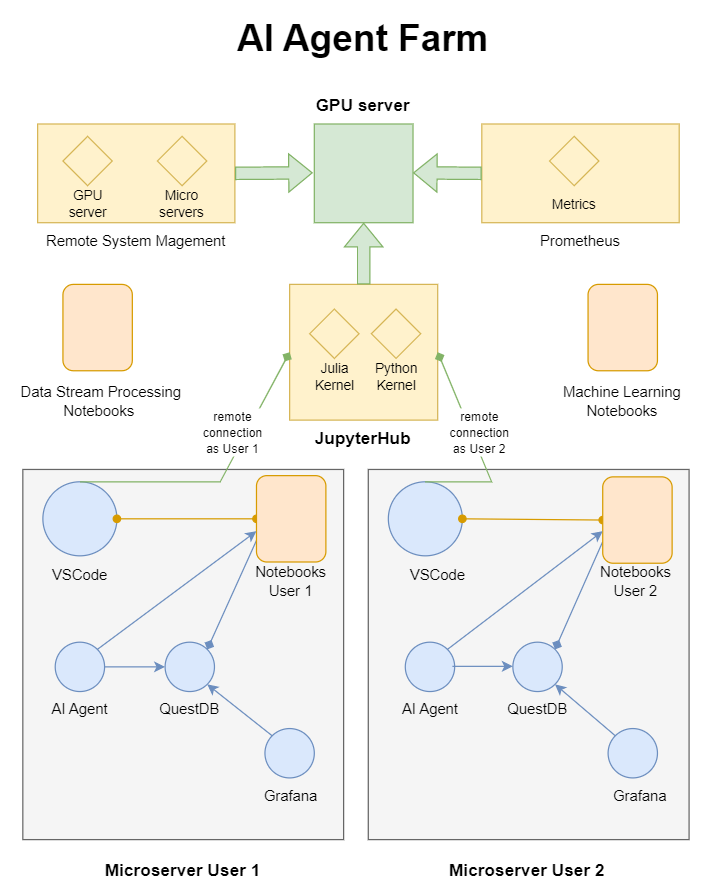

# AI Agent Farm

## Infrastructure
This repository documents the creation and maintenance of an AI Agent Farm infrastructure that consists of refurbished microservers gen8. Each microserver is equipped with a 250GB SSD, 16GB of RAM, and 4x1TB of RAID data storage for analysis. The infrastructure runs on Ubuntu 22.04 Server and includes powerful tools, such as Visual Studio Code (vscode), QuestDB, Grafana, and AutoGPT.

The purpose of this project is to create a scalable infrastructure that can run multiple tasks simultaneously and distribute processes across the AI Agent workers, maximizing efficiency and minimizing downtime. As a demonstration, we have created a specific environment for testing the AI Agent Farm in the field of financial markets.

### Infrastructure Diagram

 

:pencil: this diagram has been generated using [app.diagrams.net](https://app.diagrams.net/)

### Features
- The AI Agents can run multiple tasks simultaneously, and processes are distributed across the workers for maximum efficiency.

- The AI Agent Farm is designed to be scalable to accomodate future growth

- Vscode is remotely connected to a JupyterHub instance installed on a GPU server, providing access to Python and Julia kernels. Each AI Agent has its own JupyterHub user account when using vscode.

- The real-time streaming data source from Coinbase is connected to each microserver. QuestDB and Grafana are used to store and display the data in real-time. The QuestDB database is ingested by running a notebook in Visual Studio Code (VS Code).

- To ensure data integrity, both the QuestDB database backup and the workspace backup for each AI agent are stored on the GPU server.

### Scalability
The AI Agent Farm has been designed with scalability in mind, ensuring that it can accommodate future growth without any issues. Whether the demand for AI agents increases tenfold or hundredfold, the system is well-equipped to meet it, thanks to JupyterHub. JupyterHub is capable of supporting more than 100 users, making it an ideal tool for managing large-scale AI projects. JupyterHub can be configured to allocate a specific amount of resources (e.g., CPU cores, memory, and GPU) to each environment, depending on the requirements of the tasks that the AI Agent intends to run.

### Dockerization
The four applications used in this project (vscode, QuestDB, Grafana, and AutoGPT) can be Dockerized to simplify deployment and management. The Dockerfiles for each application are included in the repository, and instructions for building and running the Docker containers are provided in the documentation. By Dockerizing the applications, it is possible to create a self-contained environment that can be easily moved between systems or replicated on multiple machines. This can simplify deployment and ensure consistency across different environments.

### Backup
To ensure data integrity and prevent data loss, it is important to create regular backups of the QuestDB database and the AI Agent workspace on the remote GPU server.The backup process can be automated using a shell script, which can be scheduled to run regularly using a cron job. 

### Failover & Remote Management System
The AI Agent Farm also includes failover and load balancing functions to ensure high availability and prevent downtime. In addition, a remote management system is provided to enable easy monitoring and control of the infrastructure from anywhere even without a public IP. 

## AI Application Specifications:
The AI application is responsible for managing the AI agents installed on the microservers and distributing tasks to them. The application is installed on a GPU server and is designed to maximize the efficiency of the AI Agent Farm.

The AI application is built using Python and is designed to work with the JupyterHub instance running on the GPU server. The application is modular and allows for easy integration with new AI tools and libraries as needed.

The AI application consists of several modules, including:

1. Data Ingestion Module: This module is responsible for coordinating the ingestion of real-time streaming data from Coinbase across all AI agents and storing it on the RAID storage of each microserver. Each AI agent is responsible for ingesting and storing data in its own QuestDB database. The module includes features such as data validation, error handling, and data transformation to prepare the data for analysis by the AI agents.

2. Task Distribution Module: This module is responsible for distributing tasks to the AI agents installed on the microservers. The module takes into account the processing power and workload of each AI agent and distributes tasks accordingly to maximize efficiency and minimize downtime. The module is designed to handle multiple tasks simultaneously and can be configured to prioritize certain tasks over others based on their importance or urgency.

3. Performance Monitoring Module: The Prometheus module monitors the performance of each AI agent and the overall performance of the AI Agent Farm. The module collects metrics such as CPU and memory usage, task completion rates, and system uptime, which are then displayed on the Grafana dashboard. The module can be configured to send alerts if performance falls below certain thresholds or if critical errors occur.

## Data Stream Processing & Machine Learning Notebooks

The Data Stream Processing Notebook is responsible for ingesting, processing, and analyzing real-time data streams from various sources, such as financial data streams, sensors or social media feeds. It uses tools like QuestDB and Grafana to store and visualize the data, and can be integrated with other tools like Visual Studio Code.

The Machine Learning Notebook is designed to facilitate machine learning tasks, such as building and training machine learning models, and analyzing data. It typically comes pre-configured with popular machine learning frameworks and libraries, and can support a wide range of data formats and sources.

## CPU & GPU Serveur Resources

The AI Agent Farm is equipped with a powerful GPU configuration to support advanced machine learning and artificial intelligence tasks. The system features a choice of 8 GPUs, including the Tesla K80, Tesla P100, or Tesla V100, all of which offer exceptional performance and reliability.

In addition to the GPU options, the system is also equipped with dual Intel Xeon E5-2680 V3 2.5Ghz 12 Core 24 Threads Processors, providing powerful processing capabilities. The system also boasts a generous 256GB of RAM, made up of 16 x 16GB DDR4 REG 2133 modules, ensuring fast and efficient data processing.

To support the storage needs of the AI Agent Farm, the system features 2 x 1TB SSD of RAID Ubuntu 22.04 Server for operating system and software, as well as 2X10TB SATA of RAID data storage for backup, providing ample space for large datasets and ensuring data security. Overall, this GPU configuration is optimized for high-performance computing and is well-suited for AI applications that require large-scale data processing and analysis.

## References

- HP ProLiant MicroServer Gen8 Review. [StorageReview.com](https://www.storagereview.com/review/hp-proliant-microserver-gen8-review)

- [JupyterHub](https://jupyter.org/hub)

- [JupyterHub Installation Guide](https://github.com/jupyterhub/jupyterhub-the-hard-way/blob/HEAD/docs/installation-guide-hard.md)

- Connect to a JupyterHub from Visual Studio Code. [Jupyter Blog](https://blog.jupyter.org/connect-to-a-jupyterhub-from-visual-studio-code-ed7ed3a31bcb)

- [Visual Studio Code](https://code.visualstudio.com/)

- [QuestDB - The Fastest Open Source Time Series Database](https://questdb.io/)

- [Grafana - The open observability platform](https://grafana.com/)

- [Auto-GPT](https://github.com/Significant-Gravitas/Auto-GPT)

- Failover & Remote Management System [Teltonika Networks RMS](https://teltonika-networks.com/products/rms)

## Others

### Contributing
Contributions to the project are welcome. Please feel free to fork the repository and submit pull requests.  If you need to test AI-related tasks that require a remote connection to the GPU Server, you can request tokens for AI Agent Farm development purposes only. Please reach out to us to discuss your requirements and get the necessary permissions.

### Licence
This project is licensed under the MIT License.

### Conclusion
The AI Agent Farm is a powerful infrastructure for running multiple AI tasks simultaneously, and distributing them across the workers for maximum efficiency. By dockerizing the applications and automating the backup process, the infrastructure is easy to deploy and manage, and data integrity is ensured. With its scalability and powerful tools, the AI Agent Farm is an essential tool for any AI project.
