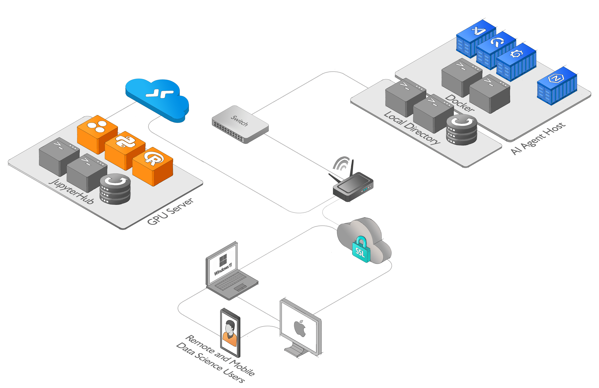

# AI Agent Host

The AI Agent Host is a module-based environment designed to facilitate rapid experimentation and testing. It includes a docker-compose configuration with QuestDB, Grafana, and Code-Server. The AI Agent Host provides a seamless interface for managing and querying data, visualizing results, and coding in real-time.

The AI Agent Host is built specifically for `LangChain`, a framework dedicated to developing applications powered by language models. LangChain recognizes that the most powerful and distinctive applications go beyond simply utilizing a language model and strive to be data-aware and agentic. Being `data-aware` involves connecting a language model to other sources of data, enabling a comprehensive understanding and analysis of information. Additionally, being `agentic` allows a language model to actively interact with its environment. The AI Agent Host aligns with these principles and serves as a framework that supports LangChain's vision, providing a module-based environment for seamless data management, visualization, and real-time coding, thereby empowering developers to create advanced language model-driven applications.

## Features

1. **QuestDB**: QuestDB is a high-performance, open-source time-series database. It allows for efficient storage and querying of time-series data, making it ideal for working with real-time data streams.

2. **Grafana**: Grafana is a popular open-source platform for data visualization and monitoring. It provides a rich set of features for creating interactive dashboards and visualizing data from various sources.

3. **Code-Server**: Code-Server is a web-based IDE based on Visual Studio Code. It provides a familiar coding environment with features such as code completion, syntax highlighting, and debugging capabilities.

## Getting Started

To use the AI Agent Host, follow these steps:

1. Set up or use an existing environment with Docker installed.

2. Clone the AI Agent Host repository and navigate to the docker directory.
```
git clone https://github.com/BouarfaMahi/AI-Agent-Host.git
cd AI-Agent-Host

```
3. Launch the AI Agent Host using the provided docker-compose configuration.

```
docker-compose up -d

```

4. Once the services are up and running, you can access the AI Agent Host interfaces:

- QuestDB: Visit https://questdb.domain.tld in your web browser.
- Grafana: Visit https://grafana.domain.tld in your web browser.
- Code-Server: Visit https://vscode.domain.tld in your web browser.

5. To connect the AI Agent Host to a remote JupyterHub environment from Code-Server:

- Set up or use an existing remote JupyterHub that includes the necessary dependencies for working with your notebooks and data.

- Connect to the remote JupyterHub environment from within the Code-Server interface provided by the AI Agent Host

Start working with your notebooks and data, using the pre-installed tools and libraries that are included in your remote environment.

### AI Agent Host Architecture Diagram

 
 
:pencil: High resolution diagram [Application architecture diagram](https://raw.githubusercontent.com/BouarfaMahi/AI-Agent-Host/master/ai-agent-host-diagram.png)