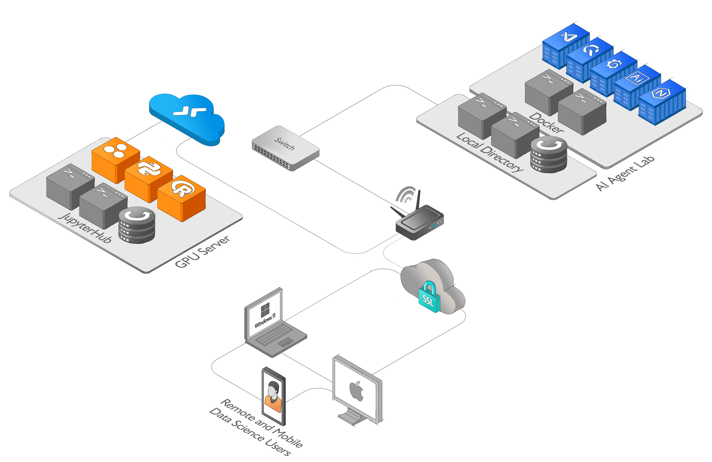

# AI Agent Lab

The AI Agent Lab is a module-based environment for working with the GPT-3.5 architecture, designed to facilitate rapid experimentation and testing of language models. The AI Agent Lab includes a docker-compose configuration with QuestDB, Grafana, Code-Server, Nginx and an AI Agent, providing a seamless interface for managing and querying data, visualizing results, and coding in real-time. With the AI Agent Lab, users can quickly set up a notebook environment and start experimenting with GPT-3.5 models, without the need for complex setup or configuration

The AI Agent Lab is also the basis for the AI Agent Farm, a modular system for developing and deploying AI agents. By using the AI Agent Lab as a module in the AI Agent Farm, users can easily connect their agents to real-time data streams and other sources of information, allowing for more sophisticated and accurate decision-making. With its flexible and modular design, AI-Agent-Lab is a powerful tool for anyone working with GPT-3.5 models and data streams in their AI applications.

To use AI Agent Lab with a remote JupyterHub environment, follow these steps:

- Set up or use an existing remote JupyterHub that includes the necessary dependencies for working with GPT-3.5 models and data streams.

- Launch the AI Agent Lab using the provided docker-compose file.

- Connect to the remote JupyterHub environment from within the Code-Server interface provided by AI-Agent-Lab.

Start working with GPT-3.5 models and data streams, using the pre-installed tools and libraries that are included in your remote environment.

### AI Agent Lab Architecture Diagram

 
 
:pencil: High resolution diagram [Application architecture diagram](https://github.com/quantiota/AI-Agent-Farm/tree/master/doc/ai-agent-lab/ai-agent-lab-diagram.png)

