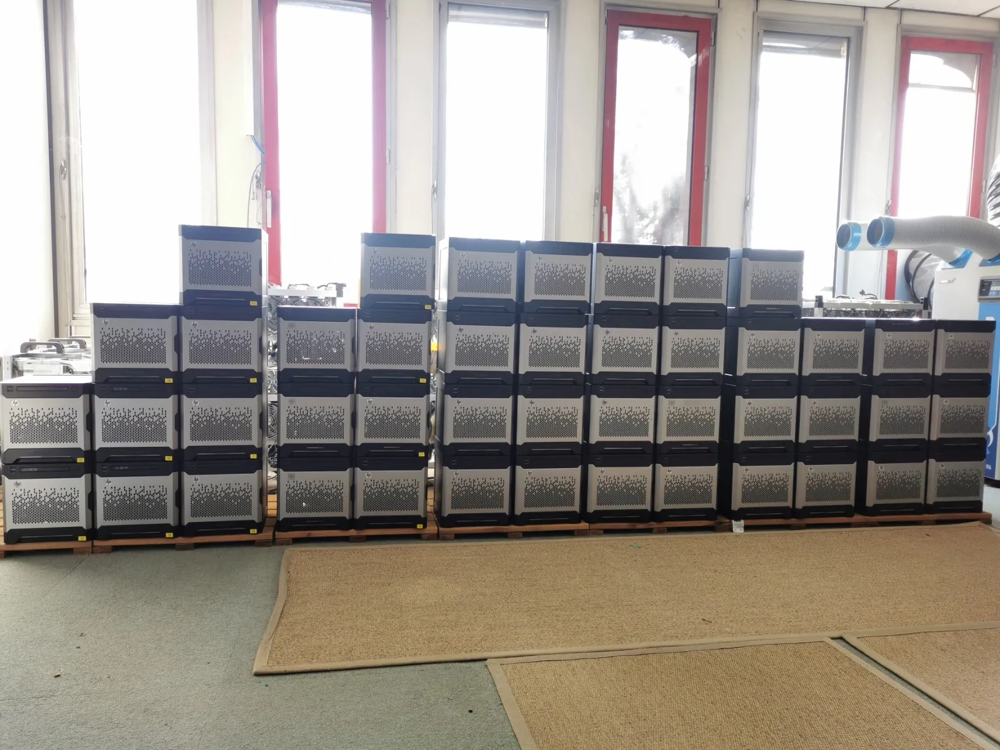
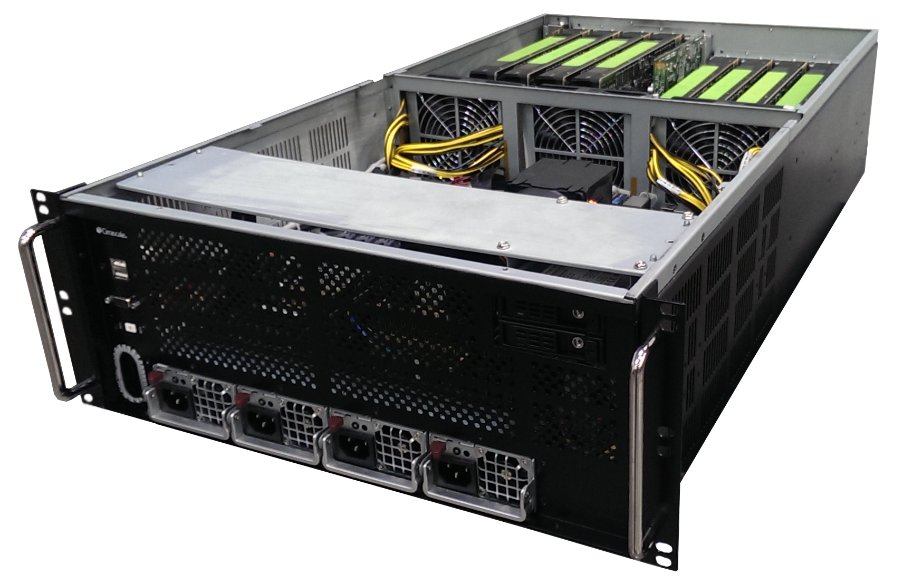

# Hardware List

| Components | Description |
| --- | --- |
| | ||
| GPU Server | Refurbished Cirrascale GX8 |
| Motherboard | ASUS Z10PE-D16 WS |
| CPU | Dual Intel Xeon E5-2680 V3 2.5Ghz 12 Cores 24 Threads per Processor, up to Xeon E5 Familly V4 |
| RAM | 16x16GB DDR4 REG 2133 256 GB  up to 1024 GB |
|GPU| Nvidia: Tesla K80, Tesla P100, Tesla V100 |
|SSD | 2 x 2TB Samsung 860 EVO  |
|HDD|2 x 10TB Western Digital Enterprise Storage|
|RAID Controller | LSI MegaRAID 9271-8i PCI-E 3.0 8-Port 6Gbps  |
| |  |
| | |
|||
|||
| Microserver | Refurbished HP Microserver Gen8 with quad-core Intel processor and 3 Ethernet ports|
| CPU| quad-core: Xeon E3-1260L, Xeon E3-1265L V2, Xeon E3-1220 V2, Xeon E3-1225 V2, Xeon E3-1230 V2, Xeon E3-1240 V2,  Xeon E3-1270 V2|
|RAM|16GB (2x8GB) Dual Rank x8 PC3-12800E (DDR3-1600) Unbuffered CAS-11  669324-B21|
|SSD | 1 x 250GB  Samsung 860 EVO |
|HDD | 4 X 1TB Western Digital Enterprise Storage |
|RAID Controler | HP P410/512MB |
| | |
| |  |
|||
|||
|Miscellaneous| Other components necessary for setting up and maintaining the AI Agent Farm|
| Switch | TP-Link SG3452 JetStream 48-Port Gigabit L2 Managed Switch with 4 SFP Slots|
|Fiber-Optic Internet Box| Primary ISP| 
|4G LTE Router| Teltonika RUT955 Secondary ISP|
|4G LTE Outdoor Antenna|QuWireless QuMax with IP67 enclosure for RUT955|
| Monitoring Server | Refurbished DELL R210 II |
| Monitor Rack Console | Refurbished DELL Rack Console 17FP |
| Power Distribution Unit | APC AP 7822  |
|Server Rack Enclosure| Refurbished HP/DELL 42U Rack Enclosure |

## Microservers 

45 refurbished Gen8 microservers used in the AI Agent Farm.

 

:pencil: High resolution image [Refurbished Microservers](https://raw.githubusercontent.com/quantiota/AI-Agent-Farm/master/doc/it-admin/hardware/images/microservers.png)

                                                                                                            
##  GPU Server 

1 refurbished Cirrascale GX8 Series used in the AI Agent Farm.

 

:pencil: High resolution image [Refurbished GPU Server](https://raw.githubusercontent.com/quantiota/AI-Agent-Farm/master/doc/it-admin/hardware/images/cirrascale.png)

