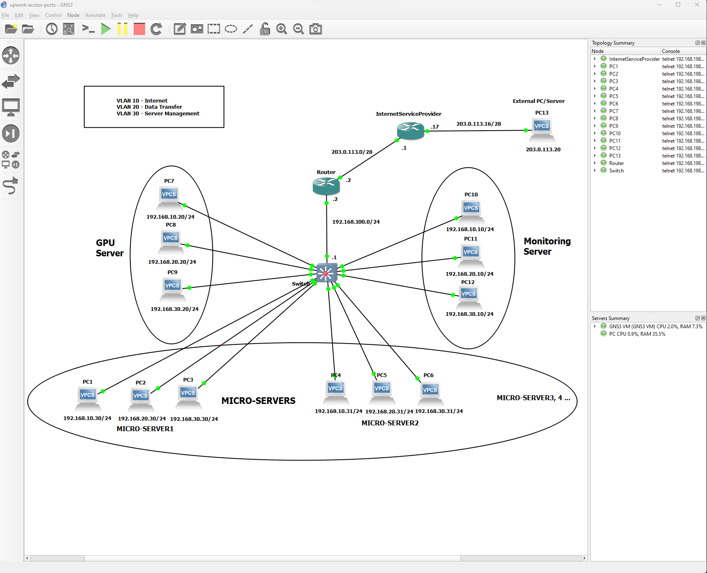

The AI Agent Farm Network Design is deployed and tested in GNS3 using specified design parameters.  
Both router and switch configuration files can be found in same directory under names of router-config.txt and switch-config.txt.    
Each Server has three seperate interfaces (Eth1, Eth2 and Eth3) so three different PC's are used to represent each server using separate interfaces.Each Server NIC will be configured with separate interface addresses.  
All ports connected to switch from servers are configured as access ports.  
IP routing has been enabled on switch as layer 3 switch will avoid congestion on router using all VLAN's traffic.  
Switchport access mode required to be configured on switch for all ports except port connected to router for routing traffic.  
Public IP Address required for NAT Translation is 25 = 64 for 10 Microservers with three interfaces each, 1 Monitoring Server and 1 GPU server with three interfaces each with a total of 36 unique IP addresses. 
    
  
### GNS3 Network Design  
