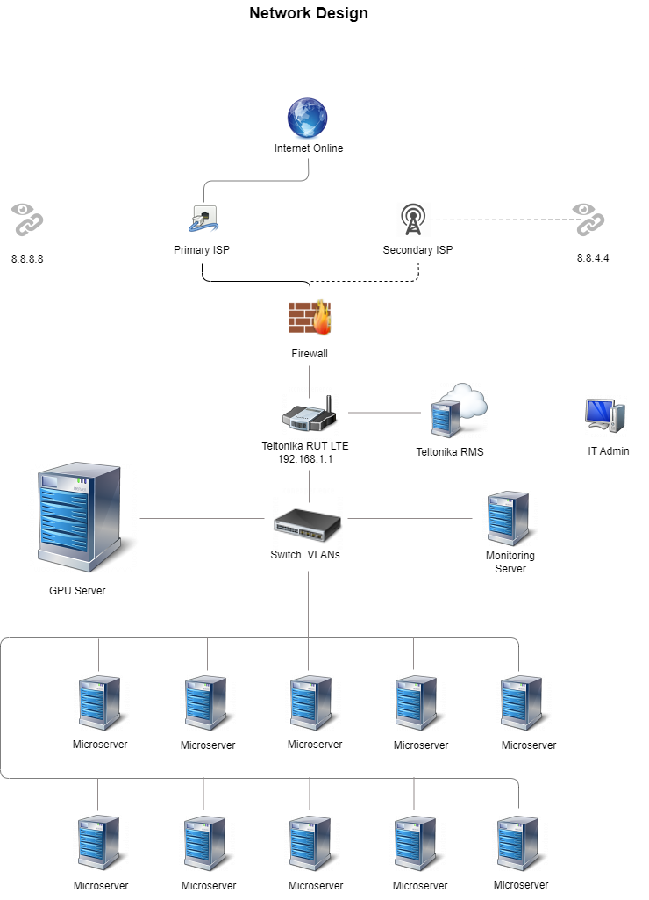

## Readme

The AI Agent Farm network is designed with high availability and scalability in mind. The following diagram illustrates the network design.

The AI Agent Farm is connected to the internet through a fiber-optic internet box, which is the primary ISP. 

The fiber-optic internet box is in a bridge mode and is connected to the WAN port of the 4G LTE router through an Ethernet cable. 

The switch is used to connect the GPU server, microserver, and monitoring server to the network.

The switch also connects to the LAN port of the 4G LTE router through an Ethernet cable. 

The 4G LTE outdoor antenna is designed to have the 4G LTE router installed inside IP67 enclosure.

