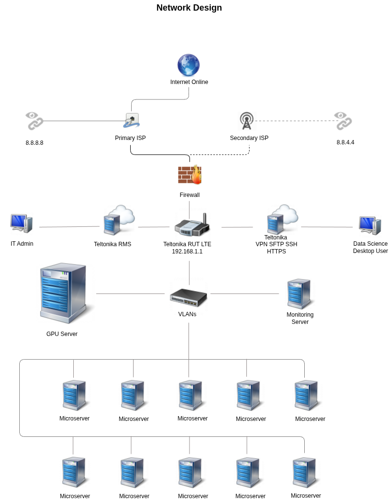

## Readme

The AI Agent Farm network is designed with high availability and scalability in mind. The following diagram illustrates the network design.

The AI Agent Farm is connected to the internet through a fiber-optic internet box, which is the primary ISP. 

The fiber-optic internet box is in a bridge mode and is connected to the WAN port of the 4G LTE router through an Ethernet cable. 

The switch is used to connect the GPU server, microservers, and monitoring server to the network.

The switch also connects to the LAN port of the 4G LTE router through an Ethernet cable. 

The 4G LTE outdoor antenna is designed to have the 4G LTE router installed inside IP67 enclosure.

### Network Configuration:

1. GPU Server: Connect eth1 to VLAN 10 (Internet), eth2 to VLAN 20 (Data Transfer), and eth3 to VLAN 30 (Server Management).

2. Microservers (10): Each microserver should connect eth1 to VLAN 20 (Data Transfer) and eth2 to VLAN 30 (Server Management).

3. Monitoring Server: Connect eth1 to VLAN 10 (Internet), eth2 to VLAN 20 (Data Transfer), and eth3 to VLAN 30 (Server Management).

3. Managed Switch: Configure VLANs 10, 20, and 30 on the switch. Assign appropriate ports to each VLAN as per the requirements mentioned above.

4. Router: Configure VLAN routing on the router to allow inter-VLAN communication. Connect the router to the internet and assign the appropriate VLAN tag for VLAN 10.

### VLAN Configuration:

1. VLAN 10 (Internet): Connects the GPU Server's eth1, Monitoring Server's eth1, and the router.

2. VLAN 20 (Data Transfer): Connects the GPU Server's eth2, Monitoring Server's eth2, and the microservers' eth1.

3. VLAN 30 (Server Management): Connects the GPU Server's eth3, Monitoring Server's eth3, and the microservers' eth2.

Ensure that appropriate IP addresses, subnet masks, and default gateway settings are configured for each VLAN and device.

### network design diagram

