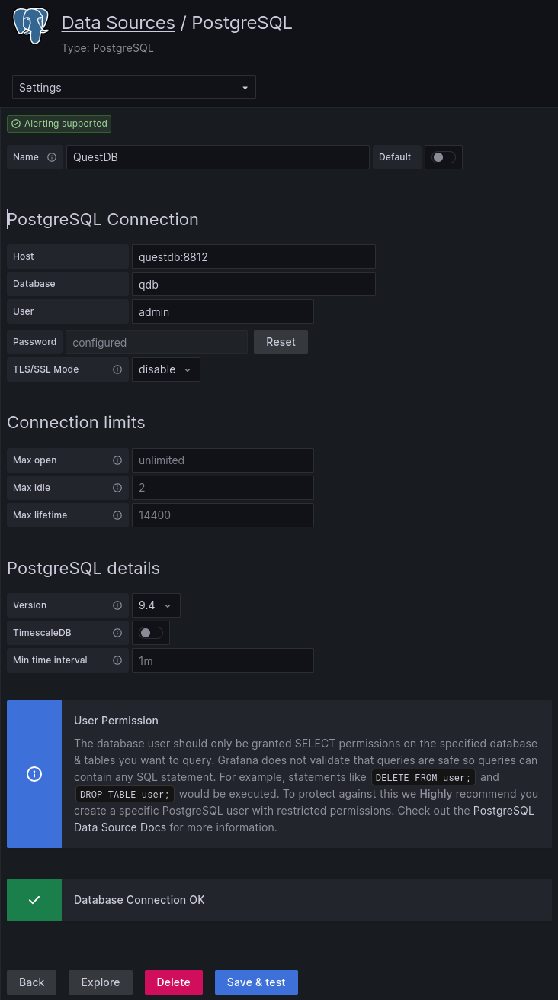

# Grafana configuration

## Datasource

Go under *Settings* > *Data sources* > *Add new data source* then select *PostgreSQL* and fill the fields as below:

## Dashboard

### Export it

In the menu, select *Dashboards* > *Browse* > *Dashboard Settings* > *JSON Model* then copy/paste the *JSON Model* in a `.json` file.

:warning: In our case, the `.json` file is available in the [dashboards folder](./dashboards/).

### Import it

In the menu, select the *Dashboards* > *+ Import* then paste the `.json` file then *Load* it and import it.
