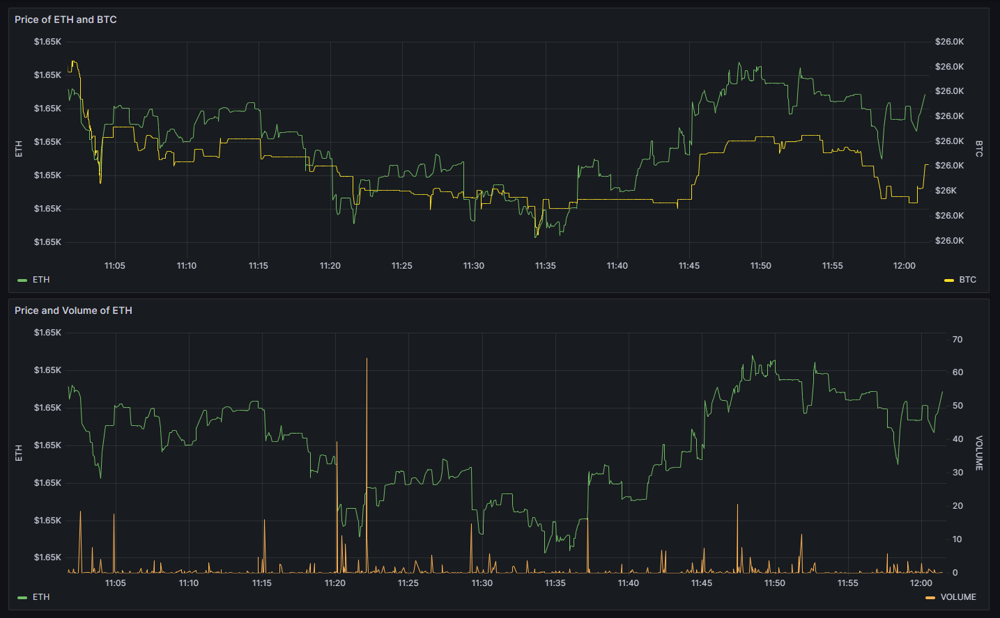

## Real-time Synchronization of Coinbase Trades to QuestDB using WebSockets in Python

This script achieves real-time synchronization between Coinbase, a popular cryptocurrency exchange, and QuestDB, a high-performance, time-series database. Initially, it establishes a connection to Coinbase's Websocket feed and subscribes to match events for BTC-USD and ETH-USD trading pairs. Concurrently, it connects to a QuestDB instance running on a Docker host. If not already present, a table named 'coinbase_matches' is created to store trading match details. The script continuously listens for new data from Coinbase, and upon receiving, inserts the data into the 'coinbase_matches' table in QuestDB. If the websocket connection closes unexpectedly, it attempts a reconnection. Additionally, if any other unexpected errors occur during data retrieval or insertion, the script prints the error for debugging purposes.

## Creating the QuestDB Database

Before starting the synchronization process, ensure you have a QuestDB instance running. You can create a database in QuestDB by either using the command-line interface or via the QuestDB web console.

To create the necessary table in QuestDB, use the following SQL:

```
CREATE TABLE coinbase_matches (
    symbol SYMBOL,      -- Stores the symbol of the trade (BTC-USD, ETH-USD, etc.)
    id DOUBLE,          -- Stores the trade ID
    price DOUBLE,       -- Stores the price of the trade
    size DOUBLE,        -- Stores the size of the trade
    side DOUBLE,        -- Stores the side of the trade (1 for buy, -1 for sell)
    timestamp TIMESTAMP -- Stores the timestamp of the trade
) TIMESTAMP(timestamp);

```

## Real-time Synchronization of Coinbase Trades to QuestDB using QuestDB with Producer/Consumer Pattern in Julia Notebook.
The Julia notebook sets up a producer/consumer pattern to build a cryptocurrency trade database using QuestDB. The Trade struct is created to store trade data, with a RemoteChannel (from the Distributed package) created to store trades. The WebSocket feed from CoinbasePro is connected, and the relevant fields from incoming JSON objects are parsed and stored as trades in the RemoteChannel. The notebook sets up a QuestDB connection and creates a table with the columns corresponding to the Trade struct. A consumer process reads from the RemoteChannel and writes data to the QuestDB table. The end result is a database of trades that can be queried for further analysis.

Set up parameter:


```
using Sockets
function save_trades_quest(trades)
    cs = connect("docker_host_ip_address", 9009)
    while true
        payload = build_payload(take!(trades))
        write(cs, (payload))
    end
    close(cs)
end
```

1. Remember to replace **<docker_host_ip_address>** with the actual IP address of the Docker host where your server is running.

2. Update the jupyter extension to the pre-release version and then click on the reload button.

3. To establish a remote JupyterHub connection from code-server, refer to this [Tutorial](https://code.visualstudio.com/docs/datascience/jupyter-notebooks#_connect-to-a-remote-jupyter-server) for guidance. Create an [API token](https://jupyterhub.readthedocs.io/en/stable/howto/rest.html#create-an-api-token) and use the provided URL:

```
https://<your-hub-url>/user/<your-hub-user-name>/?token=<your-token>
```

3. Configure port forwarding.

 If you are using JupyterHub on a remote server, you'll need to configure port forwarding either on the server itself or on any intermediate network devices, such as routers or firewalls.

- **Server-level port forwarding**: Configure port forwarding on the server so that it forwards incoming connections on port 9009 to the Docker host's IP address and the same port (9009).

- **Network device port forwarding**: If there are intermediate network devices between the JupyterHub server and the Docker host, configure port forwarding on these devices to route traffic from the desired source IP and port to the Docker host's IP and port (9009).

After configuring the port forwarding, you should test it. You can do this by attempting to connect to the Docker host's IP address on port 9009 from the JupyterHub server. For example, you can use the following command:

```
telnet docker_host_ip_address 9009

```

Remember to replace **<docker_host_ip_address>** with the actual IP address of the Docker host where your server is running.


3. Run the Data Stream Processing Notebook

Click on the '**Run All**' button in the toolbar and then check the Grafana dashboard for real-time visualization of market data.


## SQL Queries for Real-Time Analytics and Aggregations on Trades Table in QuestDB
SQL query written for QuestDB, a time-series database optimized for high-performance querying and real-time analytics. The queries select data from a "trades" table, specifically focusing on the timestamp, price, and size columns. They perform various aggregations such as capturing the first price for each 1-second interval for Ethereum (ETH) and Bitcoin (BTC), as well as summing up the trading volume (size) for Ethereum (ETH). The WHERE clause filters the dataset to include only trades for the symbols "ETH-USD" and "BTC-USD" with timestamps within the last day. The queries sample the data in 1-second intervals, aligned to the calendar, making them ideal for high-frequency time-series analysis. The result set includes columns for the Ethereum and Bitcoin prices and also provides the summed trading volume for Ethereum.

## Grafana Dashboard for Time-Series Data Visualization of ETH (Ethereum) and BTC (Bitcoin) with QuestDB Data Source and SQL Query
JSON dashboard file for Grafana, a platform for monitoring and visualizing metrics from various data sources. The dashboard has an ID of 1 and showcases time-series data for both ETH (Ethereum) and BTC (Bitcoin). The data is pulled from a QuestDB data source with the use of SQL queries that fetch metrics like real-time prices for the past 24 hours. The dashboard features two panels: one for displaying the prices of ETH and BTC, and another focusing on the price and volume of ETH.  

 